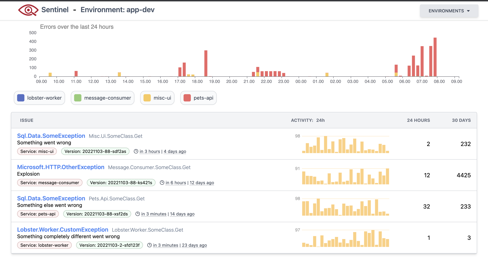
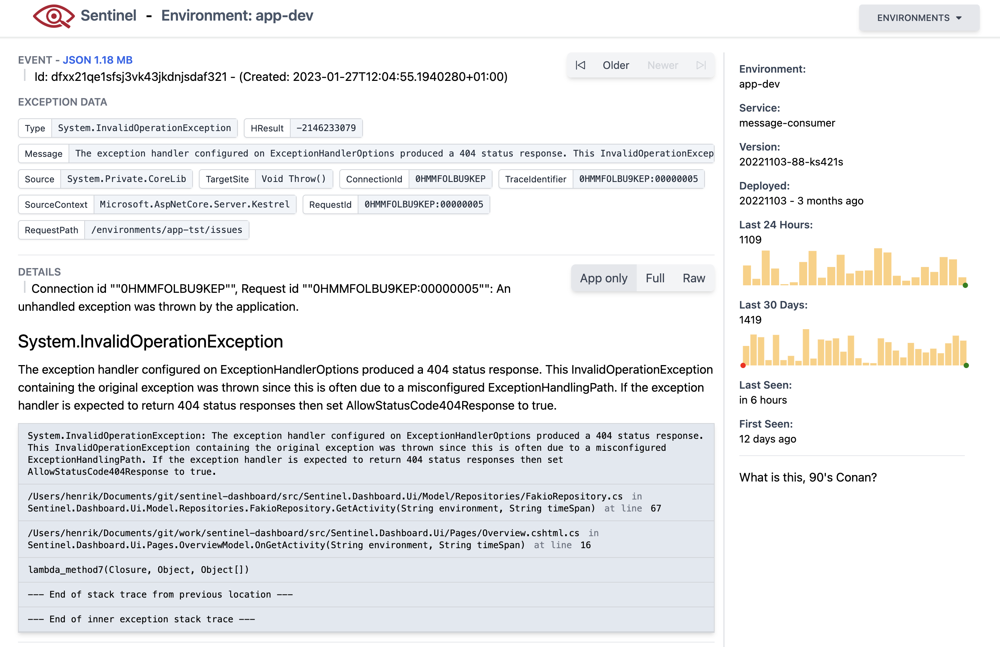

# Sentinel Dashboard

The sentinel dashboard is meant as a lightweight tool to help developers work with the output of structured json logs (currently limited to serilog's format). 

Some developers can be reluctant to embrace [structured logging](https://www.sumologic.com/glossary/structured-logging) which is otherwise a powerfull tool to manage exceptions in a microservice architecture. To enable the use of structured logging using the JSON format, 

## Overview 

The dashboard presents the developer with a quick overview of issues for the last 24 hours in a specific environment. A single issues represents multiple exceptions of the same type that occoured in the last 24 hours, the grouping of events is currently only built for .net core, and uses somewhat complicated humio query that groups by message template and source context.

To further help the developer the dashboard also provides a number of usefull graphs to get a quick overview of how many times each issue has arrisen in the last 24 hours. 

## Detail View

By clicking on the issue you can see a detail page that includes the exception details, stacktrace and any data included with the exception (the main benefit of structured logging is to enrich the exception context and add data when errors occour to ease debugging). This page also includes 2 graphs with activity for the last 24 hours and 30 days. and the ability to switch between raw stack trace and different summerized views.
